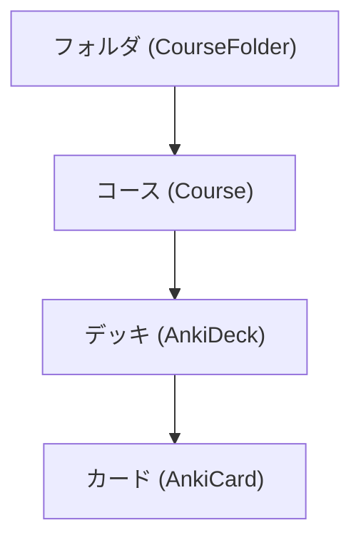

# kskAnki システム要件定義書 (Requirements Specification)

本書は、モバイル暗記カードアプリ `kskAnki` の機能要件、画面要件、およびシステム仕様をまとめた要件定義書です。

---

## 1. アプリ概要・技術スタック

- **アプリ名称**: kskAnki
- **対応OS**: iOS 17.0+ (iPhone縦画面表示に最適化)
- **開発言語・フレームワーク**: Swift 6, SwiftUI, Combine, AVFoundation, PhotosUI
- **アーキテクチャ**: SwiftUI Native Data Flow (`@Observable`, `NavigationStack`, `Form`, `ScrollView`)
- **学習アルゴリズム**: SuperMemo SM-2 をベースとした 3段階判定（◯ / △ / ✕）対応 Spaced Repetition (間隔反復) スケジューラー

---

## 2. システム構造・データモデル

### 2.1 階層構造

### 2.2 データモデル定義
- **CourseFolder**: ID, フォルダ名, アイコン名
- **Course**: ID, コース名, 説明, アイコン名, テーマカラー, 属するフォルダID, 最終学習日時, 更新日時
- **AnkiCard**:
  - `id`: UUID
  - `frontText`: 表面テキスト
  - `backText`: 解答テキスト
  - `frontType`: 表面表示パターン (`.question`, `.word`, `.cloze`)
  - **裏面詳細フィールド**:
    - `japaneseTranslation`: 日本語訳 / 和訳
    - `exampleSentence`: 例文
    - `exampleTranslation`: 例文の和訳
    - `synonyms`: 類義語
    - `antonyms`: 反対語 / 対義語
    - `explanation1`, `explanation2`, `explanation3`: 解説1〜3
  - **カテゴリー**:
    - `mainCategory`: メインカテゴリー (例: 英語, IT)
    - `subCategory`: サブカテゴリー (例: 動詞, OS)
    - `categoryPath`: 「メイン ❯ サブ」 階層表現
  - **メディア & 音声**:
    - `frontImageURLs`, `backImageURLs`: 複数画像URL/パス
    - `frontAudioURL`, `backAudioURL`: 添付音声URL/パス
    - `speechLanguage`: 音声朗読言語 (`en-US`, `ja-JP`, `es-ES` 等)
  - **学習履歴 & ステータス**:
    - `reps`: 復習回数
    - `intervalDays`: 次回復習までの日数
    - `easeFactor`: 記憶難易度係数
    - `dueDate`: 次回復習予定日
    - `lastStudiedAt`: 最終学習日時
    - `lastRating`: 前回学習時の判定 (`.correct`, `.doubtful`, `.incorrect`)
    - `wrongCount`: 累計 ✕(不正解) 回数
    - `doubtfulCount`: 累計 △(惜しい) 回数
    - `consecutiveCorrectCount`: 連続 ◯(正解) 回数

---

## 3. 機能要件・画面要件

### 3.1 トップ画面 (DeckListView)
- **コース一覧表示**:
  - 登録されているコースをカード型デザインで表示。
  - アイコン、コース名、説明文、最終学習日時、更新日時の表示。
- **新規コース作成 (CreateCourseView)**:
  - ナビゲーションバー右上の「+」メニューから「新規コースを作成」を起動。
  - コース名、説明文、アイコン (SFSymbols)、テーマカラー、所属フォルダの選択と新規登録。
- **コースのアーカイブ & 復元**:
  - コースカードの長押し / コンテキストメニューから「アーカイブする」「アーカイブから復元」を実行可能。
  - トップ画面で「アクティブコース」と「アーカイブ済みコース」の切り替え表示。
- **ソート機能**:
  - 名前順
  - 一番最近学習した順
  - 更新日順
- **ページネーション**:
  - コース数が多い場合は1ページ 3件ずつ表示。
- **フォルダ分類・作成**:
  - トップ画面上部のセグメントでフォルダ（例: 「すべて」「語学学習」「IT・資格」など）を切り替え。
  - 新規フォルダ作成モーダルシート。
- **設定画面**:
  - ナビゲーションバー右上の設定アイコンからアプリ設定画面 (`SettingsView`) へ遷移。

---

### 3.2 コース詳細・学習設定画面 (CourseDetailView)
- **画面モード切り替え**:
  - 「学習スタート」タブと「コンテンツ一覧 (N件)」タブのセグメント切替。
- **学習対象フィルタリング (StudyFilterTarget)**:
  1. **すべてのカード**
  2. **4回連続◯未達成のみ (4連勝除外)**: 4回連続で正解して完全習得したカードを自動除外。
  3. **未学習のものだけ**: まだ一度も復習していないカード。
  4. **今日学習したもの**: 本日復習を実施したカード。
  5. **昨日学習したもの**: 昨日復習を実施したカード。
  6. **1週間以内に学習したもの**: 直近7日間以内に復習を実施したカード。
  7. **前回「△」のもの** / **前回「✕」のもの** / **前回「△」または「✕」**
  8. **一度でも「△」をつけたもの** / **一度でも「✕」をつけたもの** / **一度でも「△」または「✕」**
  9. **お気に入りのみ**
- **プレビュー & 枚数選択**:
  - 選択中のフィルター条件に該当するカード枚数をリアルタイムでバッジ表示（例: `該当: 12枚`）。
  - 1回の学習枚数を選択可能（`10枚` / `20枚` / `全件`）。

---

### 3.3 学習セッション画面 (CardStudyView & FlashcardView)

#### ① カード展開UI & 片手スワイプ操作 (FlashcardView & CardStudyView)
- 表面（問題）が上部に表示され、タップすると裏面（解答・解説・例文・メモ）がスライド展開。
- **iPhone縦画面スクロール**:
  - 長文テキストや複数画像がある場合、画面枠を超えてスムーズに縦スクロール (`ScrollView`) 可能。
- **片手高速スワイプ操作 (HCI / UX改善)**:
  - 👉 **右スワイプ**: ◯ (正解)
  - 👈 **左スワイプ**: ✕ (不正解)
  - 👆 **上スワイプ**: △ (惜しい)
  - 片手持ち時でも1枚1秒のテンポでスピーディーに正誤判定・次のカードへ進む操作が可能。

#### ② ◯ △ ✕ 3択正誤判定
- 裏面が開いたタイミングで、画面下部に3つの巨大判定ボタンが出現：
  - **「✕ 不正解」** (赤): 連続正解カウントリセット、間隔リセット。
  - **「△ 惜しい」** (オレンジ): 連続正解カウントリセット、短期間隔で復習。
  - **「◯ 正解」** (緑): 連続正解カウント +1、復習間隔拡大。

#### ③ 自動音声朗読 (Auto-Play Audio)
- 裏面展開時、解答の合成音声（英語/日本語）が自動的に再生され、視覚・聴覚を同時に刺激。

#### ④ 学習途中の中断機能
- ナビゲーションバーの「中断」タップ時、確認ダイアログ (`confirmationDialog`) を表示：
  1. **「ここまでの成果を保存して中断」**: それまでの ◯/△/✕ 判定やメモを保存して終了。
  2. **「保存せずに中断」**: 今回の判定を破棄して終了。
  3. **「学習を続ける」**: セッションを継続。

#### ⑤ ユーザー個人メモ機能 (My Notes)
- 裏面展開時に以前保存した個人メモを表示。
- その場で即座にメモのインライン編集・保存が可能。

---

### 3.4 カード表面の3パターン表現

1. ❓ **通常問題パターン (`question`)**
   - 標準的な問題文スタイル。
2. 🔤 **単語カードパターン (`word`)**
   - 英単語やフレーズを画面中央に大きめの太字（28pt rounded）で強調表示。
3. 🙈 **適応型穴埋めマスクパターン (`cloze`)**
   - 文章内の `{{単語}}` または `[単語]` 箇所を動的認識。
   - **表面表示時**: デフォルトは完全伏せ字 `[ ❓ 隠し ]`。伏せ字をタップした時だけ先頭1文字目 `T [ ❓ 隠し ]` をヒント開示（自力想起の最大化）。
   - **裏面表示時**: マスクが解除され、単語全体 `[ TASK ]` をハイライト表示。
- **混在の許容**: 1つの問題セット（コース）内に「問題」「単語」「穴埋め」が混在することを完全許容。

---

### 3.5 裏面詳細フィールド & 未設定動的非表示

- 裏面項目:
  1. 解答 (Back Text)
  2. 日本語訳 / 和訳
  3. 例文 & 例文の和訳
  4. 類義語 (Synonyms) & 反対語 (Antonyms)
  5. 解説 1, 解説 2, 解説 3
- **動的非表示**:
  - 設定されている（値が存在する）項目のみを見出しバッジ付きでスマートにレンダリング。
  - 未設定の項目は空白を残さず完全自動非表示。

---

### 3.6 画像添付 & フルスクリーンズームビューアー

- **複数画像添付**: 表面・裏面それぞれに複数枚の画像を登録表示。
- **画面幅フィット**: 通常表示時はiPhone画面幅に合わせてレスポンシブフィット表示。
- **タップ拡大・ピンチズーム (`ImageDetailView`)**:
  - 画像をタップするとフルスクリーンモーダルが起動。
  - 2本指でのピンチイン・ピンチアウト（最大400%拡大）およびドラッグ移動対応。
  - ダブルタップでの拡大/元サイズ切替。
- **フォーム内の独立画像セクション & アルバム選択**:
  - 追加・編集フォームに「📷 表面の画像」「📷 裏面の画像」独立セクションを設置。
  - `PhotosPicker` により、iPhoneのフォトライブラリから直接画像を選択して登録可能（削除機能付き）。

---

### 3.7 音声再生 & TTS朗読機能 (AudioService)

- **「🔊 朗読」ボタン**: 表面・裏面の各ヘッダーに配置。
- **TTS (Text-to-Speech) 合成音声朗読**:
  - `AVSpeechSynthesizer` を使用。
  - テキストから英語 (`en-US`)・日本語 (`ja-JP`) 等を自動識別して朗読。
  - 読み上げ言語（英語・日本語・スペイン語等）の手動選択・固定も可能。
- **音声ファイル再生**: 添付音声URLがある場合は `AVPlayer` で音声再生。

---

### 3.8 コンテンツ管理 (CourseContentView, AddCardView, EditCardView)

- **カード一覧・編集・削除**:
  - コンテンツ一覧画面で各カードのカテゴリーバッジ (`メイン ❯ サブ`) を表示。
  - スワイプ削除およびタップでの編集モーダル (`EditCardView`)。
- **カード追加 (AddCardView)**:
  - 1枚ずつ手動追加（表面パターン・テキスト・画像・例文・解説1〜3・カテゴリー等のフル入力）。
  - CSV一括取り込み（`表面, 裏面, メインカテゴリー, サブカテゴリー, タグ` 形式）。

---

## 4. 非機能要件・UI設計原則

1. **Aesthetics & Premium Design**:
   - ダークモード/ライトモード対応の curated HSL カラーパレット。
   - スムーズなアニメーション（`withAnimation(.spring())`）。
2. **堅牢性**:
   - `#if canImport(UIKit)` および iOS/macOS 両環境での `swift build` コンパイル互換性維持。
3. **データ永続性・即時性**:
   - メモ編集や正誤判定、途中中断成果の即時状態反映。
